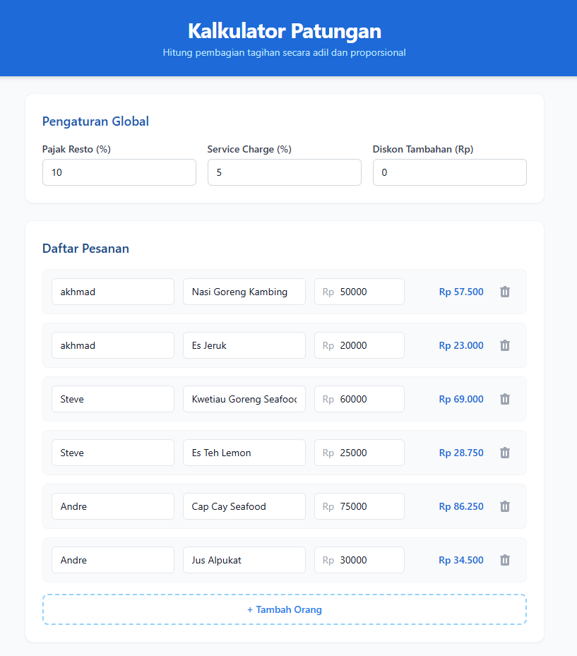
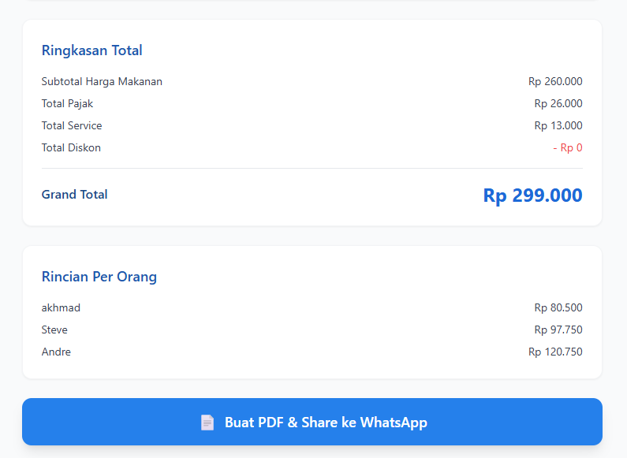

##About

 Sometime at the office we order food from Office Boy and didn't get receipt for that in indonesia, fo thie apps will usefull for that

## Screenshots






## Initial prompt

Bangun sebuah aplikasi web single-page Kalkulator Split Bill (Patungan Makan) menggunakan React dan Tailwind CSS. Aplikasi ini tidak memerlukan backend atau database eksternal, cukup gunakan local state untuk mengelola datanya.

1. Struktur Antarmuka (UI):

Header: Judul 'Kalkulator Patungan' dengan desain yang clean dan modern.

Section Global Setting (Pengaturan Tagihan):

Input 'Pajak Resto (%)' (default: 10%).

Input 'Service Charge (%)' (default: 5%).

Input 'Diskon Tambahan (Rp)' (default: 0).

Section Daftar Pesanan (Dynamic List):

Tombol '+ Tambah Orang'.

Setiap baris (item) memiliki input: 'Nama Orang', 'Nama Pesanan' (opsional), dan 'Harga Makanan (Rp)'.

Tombol hapus (ikon tong sampah) di sebelah kanan setiap baris.

Section Ringkasan Total (Summary Card):

Tampilkan 'Subtotal Harga Makanan'.

Tampilkan 'Total Pajak' (dalam Rupiah).

Tampilkan 'Total Service' (dalam Rupiah).

Tampilkan 'Total Diskon' (dalam Rupiah).

Tampilkan 'Grand Total' (dalam Rupiah) dengan teks yang besar dan tebal (bold).

2. Logika Perhitungan (Core Logic):

Buat fungsi yang menghitung proporsi tagihan setiap orang secara adil.

Rumus: Proporsi = Harga Makanan Orang / Subtotal Harga Makanan.

Beban Pajak Orang = Proporsi * Total Pajak.

Beban Service Orang = Proporsi * Total Service.

Potongan Diskon Orang = Proporsi * Total Diskon.

Total Bayar per Orang = Harga Makanan Orang + Beban Pajak Orang + Beban Service Orang - Potongan Diskon Orang.

Tampilkan 'Total Bayar per Orang' di samping setiap baris nama di daftar pesanan, ter-update secara real-time.

3. Fitur Ekspor dan Share (PDF & WhatsApp):

Tambahkan sebuah tombol besar berlabel 'Buat PDF & Share ke WhatsApp'.

Saat tombol ini diklik, gunakan library seperti jspdf dan jspdf-autotable (atau setara yang didukung) untuk men-generate file PDF berisi:

Judul: 'Rincian Tagihan Patungan' dan Tanggal hari ini.

Tabel rapi dengan kolom: Nama, Pesanan, Harga Awal, dan Total Bayar (sudah termasuk pajak & service).

Bagian bawah tabel: Grand Total yang harus ditransfer, beserta teks 'Silakan transfer ke rekening BCA/Mandiri/GoPay [Nomor Rekening Anda] a.n [Nama Anda]'.

Setelah file PDF berhasil di-generate, buat fungsi untuk membagikannya via WhatsApp API:

Format URL WhatsApp (untuk web/mobile): [https://wa.me/?text=](https://wa.me/?text=)[pesan_teks].

Pesan teks berisi rekap singkat: 'Halo! Berikut rekap patungan makan siang kita. Total keseluruhan Rp [Grand_Total]. Rincian lengkap silakan cek file PDF yang akan saya lampirkan. Mohon transfer ke [Rekening Anda]. Terima kasih!'.

(Catatan Teknis: Karena WhatsApp Web/Mobile via URL tidak bisa langsung melampirkan file PDF secara otomatis, instruksikan pengguna untuk menyimpan PDF (download otomatis) lalu membuka WhatsApp untuk attach (melampirkan) file PDF tersebut ke grup/kontak secara manual. Tombol 'Share ke WhatsApp' cukup membuka link chat dengan teks pesan yang sudah disiapkan.)

4. Styling & UX:

Gunakan format angka Rupiah (misal: Rp 150.000) di seluruh tampilan.

Gunakan palet warna yang profesional (misalnya biru laut, abu-abu terang, dan putih) agar terlihat bersih.

Pastikan antarmuka responsif dan terlihat rapi saat diakses dari layar smartphone (mobile-friendly).

##---------------------------------------------------------------------------------------------------------------------------------

# React + TypeScript + Vite

This template provides a minimal setup to get React working in Vite with HMR and some Oxlint rules.

Currently, two official plugins are available:

- [@vitejs/plugin-react](https://github.com/vitejs/vite-plugin-react/blob/main/packages/plugin-react) uses [Oxc](https://oxc.rs)
- [@vitejs/plugin-react-swc](https://github.com/vitejs/vite-plugin-react/blob/main/packages/plugin-react-swc) uses [SWC](https://swc.rs/)

## React Compiler

The React Compiler is not enabled on this template because of its impact on dev & build performances. To add it, see [this documentation](https://react.dev/learn/react-compiler/installation).

## Expanding the Oxlint configuration

If you are developing a production application, we recommend enabling type-aware lint rules by installing `oxlint-tsgolint` and editing `.oxlintrc.json`:

```json
{
  "$schema": "./node_modules/oxlint/configuration_schema.json",
  "plugins": ["react", "typescript", "oxc"],
  "options": {
    "typeAware": true
  },
  "rules": {
    "react/rules-of-hooks": "error",
    "react/only-export-components": ["warn", { "allowConstantExport": true }]
  }
}
```

See the [Oxlint rules documentation](https://oxc.rs/docs/guide/usage/linter/rules) for the full list of rules and categories.
